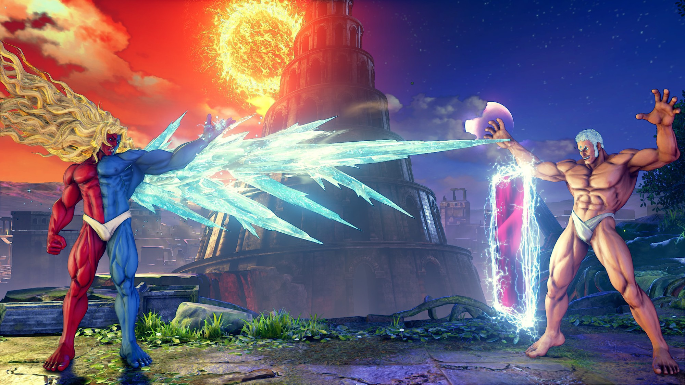
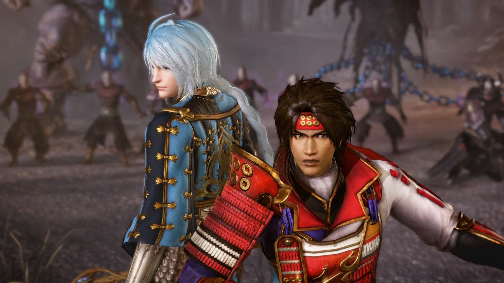
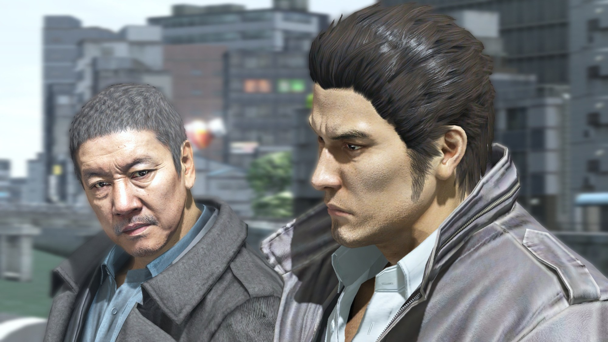
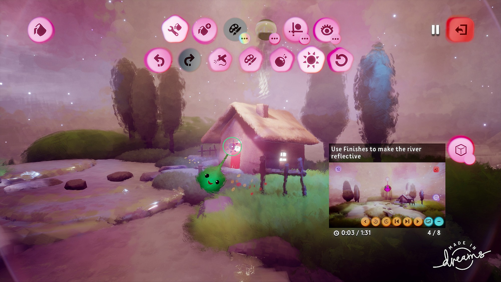
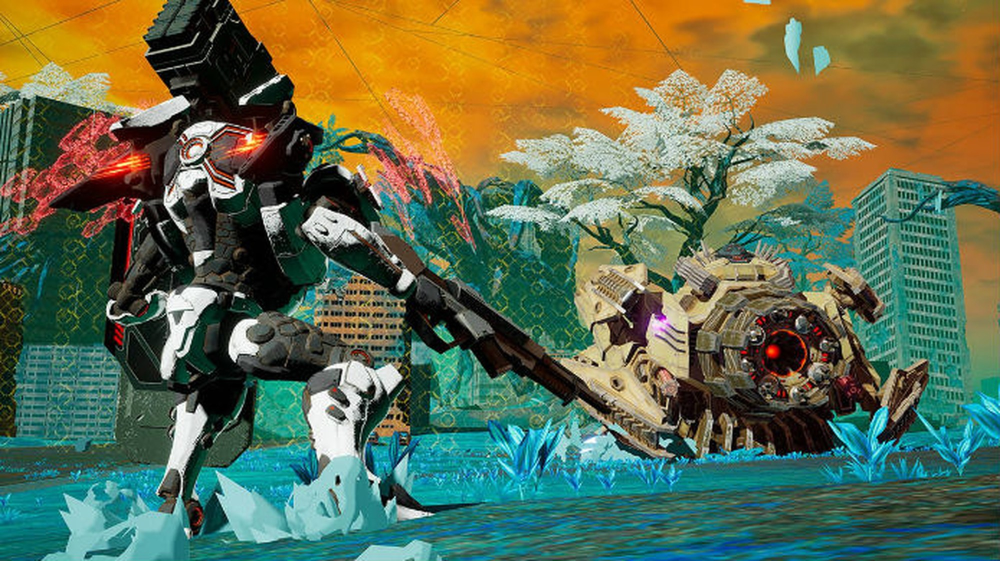

Street Fighter 5 : Champion Edition is one of this week's big releases - a new version and update of Capcom's well-known fighting game for PlayStation 4 ( PS4) and PC (via Steam ). In addition, the Yakuza 5 Remaster and Dreams, exclusive to Sony , also land on the shelves. The first is the relaunch of an action-focused RPG, while the other is a game that works as a creation tool, with almost no limits on what is possible to create. In the following lines, know all the titles that arrive in the coming days.

## Street Fighter 5: Champion Edition - PS4 and PC - February 14

Street Fighter 5: Champion Edition is yet another update to Capcom's fighting game, which will also be sold as a full game. The title contains 40 fighters, 34 levels and more than 200 clothing for the fighters. The new Street Fighter 5 will also have a balance update and news with a focus on multiplayer and competitive mode.

## Warriors Orochi 4 Ultimate - Nintendo Swicth and PS4 - February 14

Warriors Orochi 4 Ultimate is another major update coming this week. Koei Tecmo's already famous action and adventure game receives new characters, including Gaia, Yang Jian and Ryu Hayabusa, from the Ninja Gaiden saga, also from Koei Tecmo.

## Yakuza 5 Remaster - PS4 - February 11

Yakuza 5 Remaster is the relaunch of the game that originally came out in 2012, in Japan. The game brings news in the graphics, mainly, despite keeping all the content intact, besides possible text revisions and cohesion of the story. In the saga, there is Kazuma Kiryu, a Yakuza renegade who intends to try to get on with his life and escape from problems with the mafia.

## Dreams - PS4 - February 14

Dreams is more than a game: it is a game creation tool. Created by the same studio as the LittleBigPlanet series, the title allows you to fulfill any wish and “dream”, as the name says, and develop games complete with phases, enemies, challenges, among others.

## Daemon X Machina - PC - February 10

Daemon X Machina was released for the first time last year, only on Nintendo Switch , but now also comes to PC. This is a game of action, adventure and a little beating, with characters who control giant robots and must deal with the extinction of humanity.

