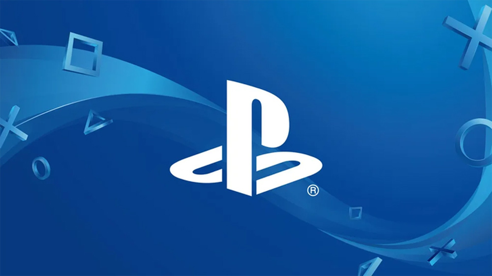
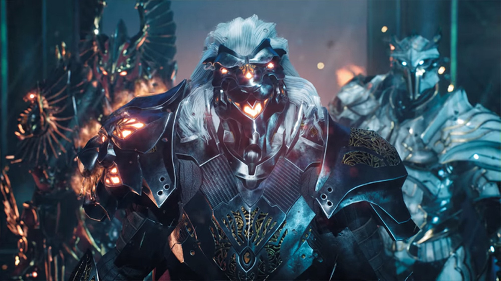
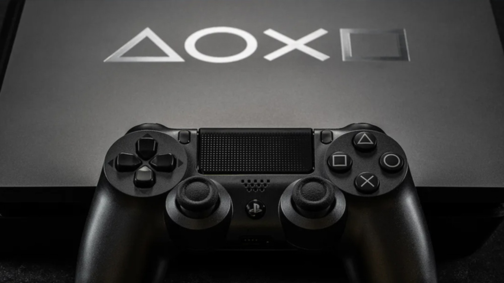
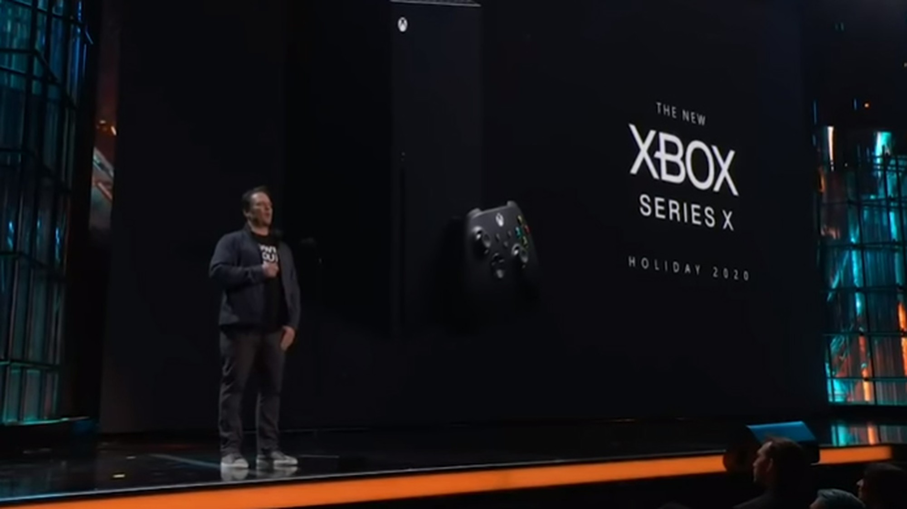

The PlayStation 5 (PS5) is Sony's next console . Successor of the current PlayStation 4 (PS4) , the launch of the new video game should happen in 2020, according to the manufacturer. Little official information about the console has been released so far, but it already has games announced and there are several rumors about its technical specifications, control (joystick) and price in the world and in Brazil. Check out some questions and answers on the PS5 below.

According to official Sony information, the PlayStation 5 will be a next generation machine with Ray Tracing technology for advanced lighting and SSD storage to make loadings faster. The machine will be backwards compatible with PlayStation 4 games and also with accessories like the PlayStation VR virtual reality display, while it will have a new joystick with new functions. Players will also be able to use the console as a Blu-Ray player to watch movies in 4K resolution.

## When will the launch be?

According to Sony itself the console will arrive by the end of 2020, in time for the holiday season. The period usually includes the last quarter of the year, a window in which sales in the United States are strongest. There were rumors that the Coronavirus outbreak in China could delay the launch of the PlayStation 5 and Xbox Series X , as both consoles are mass-produced in the country, but the companies have not spoken. Currently Nintendo has confirmed that the virus outbreak delayed production of the Nintendo Switch in the country.

## What games have already been revealed?

So far only one PlayStation 5 title has been officially revealed: Godfall. The game features third-person combat, cooperative multiplayer for up to three people, and item collection to become increasingly powerful in a mix of God of War and Borderlands that the producers called "Looter-Slasher".

Ubisoft has already confirmed that it will release improved versions of its upcoming titles also on Sony's new console, such as Watch Dogs Legion , Rainbow Six Quarantine and Gods & Monsters . The Electronic Arts announced that Battlefield plan to have six on the island around 2021 or 2022, when there is already a good installed base. Many gamers hope that PS4 end-of-life titles will also transition to PS5, such as Cyberpunk 2077 and The Last of Us Part 2.

## How will the PS5 control be?

Assuming Sony maintains the process of naming its joysticks as that of its consoles, the PlayStation 5 controller would be the DualShock 5 and there is already some information about it. Journalist Peter Rubin, from the Wired website, was one of the few who had the chance to test the controller and confirm some of its technologies, which have also appeared in Sony patents in Japan.

The joystick will have adaptive triggers that change its resistance level according to the situation. The player may feel more and more resistance when pulling a bowstring or feel the difference between a machine gun trigger and a shotgun trigger. There will also be haptic engines that will allow a more realistic "Rumble" feeling, such as gun kicks and the feeling of crossing different surfaces.

## What will be the price?

One of the most important factors that can spell success or failure for a console is the price, and Sony seems cautious about revealing it. According to Sony's chief financial officer, Hiroki Totoki, the company is still in the process of analyzing acceptable cost and price in the market, while PS5 chief developer Mark Cerny commented that it will be an attractive price for the advanced technology that the console will offer.

This information does not come to estimate a price, but analysts believe that it will be around US $ 400 (about R $ 1.7 thousand) without taxes, the same amount for which the PlayStation 4 was launched a few years ago. The console, however, uses expensive technologies like video cards capable of Ray Tracing and SSD storage, so a value of $ 500 (R $ 2,125 thousand) is not out of the question. Analysts also believe that the console will be released in a single model, without a "Pro" version at launch.

## Will it be backwards compatible?

Yes, PlayStation 5 will work with PlayStation 4 games, both in their digital and physical versions, with PS4 game discs. There are rumors that the console will be able to run even games from previous PlayStation platforms such as PlayStation One, PlayStation 2 and PlayStation 3, through an engine that would offer improvements. The idea is similar to the current Xbox One backward compatibility in Xbox 360 games and the first Xbox.

## What are the specifications? Will it be as powerful as the Xbox Series X?

For now there are no official technical specifications, however there were leaks of information and sites like Wired and Digital Foundry have analyzed what their possible configuration would be. According to the portals, the console will have a processor similar to AMD's Ryzen line with eight cores. Your video card is supposed to be a customized version of AMD's Radeon Navi cards with Ray Tracing support.

According to leaked specifications, the Xbox Series X looks more powerful today, but its parts would also be more expensive, which would mean a higher launch price. According to rumors, the next console from Microsoft may be released in two versions, one more powerful called by the code name "Anaconda" and one more accessible called "Lockhart". The power of the PlayStation 5 would apparently be in the middle of these two models.
