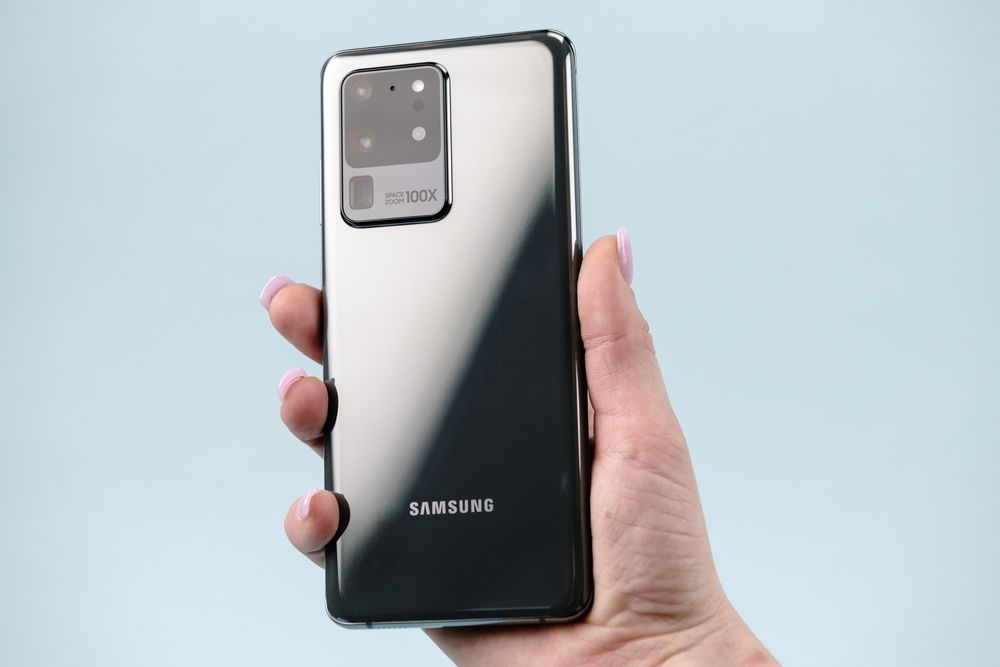

The Galaxy S20 is among us with important changes in hardware, especially in the design of the cameras. However, a non-technological aspect won social networks: the reason behind the decision to skip the name “S11” - natural successor to S10 . After all, the new models are called Galaxy S20 , Galaxy S20 Plus and Galaxy S20 Ultra . To unravel this mystery, TechTudo spoke with Mario Laffitte, vice president of Samsung Latin America.

According to the executive, there is a "unique opportunity" to take advantage of the new decade - the 2020s, despite all the discussion on the subject. "With this nomenclature, we look at the next ten years of Galaxy and the next ten years with more transformation in the use of smartphones", comments the executive.

Nothing different from what the main rival also did when announcing the iPhone X (in Roman numerals; it reads 10). The company led by Tim Cook chose to ignore the name “iPhone 9” when announcing a completely different smartphone that marked the ten years of the line in 2017.

Laffitte continues in the explanation: “It is part of the positioning of Samsung, which wants to remain a company that advances on the technology frontier. This is the main idea. ”The professional has reason to celebrate, as Samsung accounts for more than half of the smartphone market in the area that encompasses Brazil, Chile and Argentina. There are 108 units sold per minute (on average) in Latin America.

Now efforts are turning to the S20 line. Entrance prices vary between US $ 999 and US $ 1,399 in the United States, which is between R $ 4,330 and R $ 6,060 depending on the current exchange rate. They are expensive smartphones even for the purchasing power of Americans.

The vice president of Samsung Latin America says that there are countless technologies to justify the values. “The new line brings many innovations, mainly in the camera. This is one of the most important aspects for the Latin American consumer ”, he comments. In fact, the S20 and S20 Plus debut 64MP telephoto camera . The S20 Ultra offers a 108 MP wide angle (and the Xiaomi Mi 10 Pro should go the same way ).

The engineers redesigned the entire photographic module on the back of the phone, which still has its own identity. The Ultra also looks good in selfies because of the 40 MP front camera. “It was appropriate to make the leap from S10 to S20. It shows all the technology difference in the new devices ”, he concludes.

Fans of the brand may be wondering about the successor of this model. Was it the S21? The quirky executive: "We will wait 2021 to see what happens."

The S20 line runs Android 10 with One UI interface . The landing of products in Brazil is confirmed in the coming months. Although there is no official information, it is speculated in the market that the launch would be in March, a company tradition. Brazilian prices for S20, S20 Plus and S20 Ultra remain secret.

Future buyers will notice major hardware improvements, such as the screen capable of displaying content at 120 Hz and the greater accuracy of the touch panel. The curved corners were less accentuated, causing the S line to lose a striking feature of the last generations.
