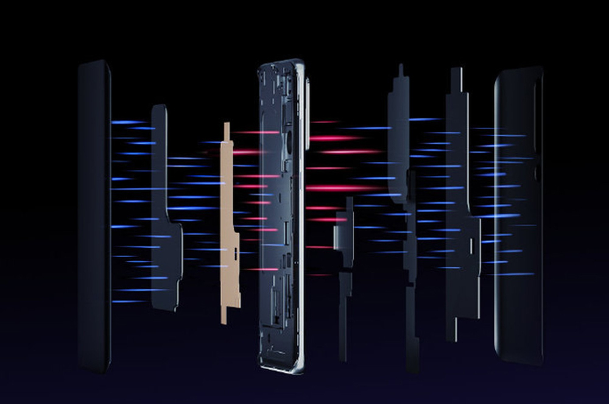

The Xiaomi will hold the global launch mobile premium Xiaomi Mi 10 on February 23 in Barcelona. The event will take place the day before the start of the MWC telecommunications fair and after the first presentation of the smartphone in an online event scheduled for next Thursday (13). The device's ad has changed due to the coronavirus outbreak in China.

The phone also had the first official images released. They confirm most of the latest leaks , including the presence of a quad camera and front sensor inside the screen . But, the photos show at least two design news. The Mi 10, along with the more powerful Mi 10 Pro, is expected to be one of the rivals of Samsung's Galaxy S20 family .

One of the visual changes is related to the screen. In the photos leaked in the last few days the display seemed flat, but in the official images it appears with curved sides. It is not yet known, however, whether the promotional material refers to only one version of the device. Another difference is in the rear, in which the fourth camera appears separate from the main set of three sensors.

Other information circulating on the Chinese social network Weibo mentions a variant called Mi Pro 5G with a powerful 108 MP camera, similar to that expected for the Galaxy S20 Ultra . Its zoom capability demonstrated last week would be even greater than expected: up to 150x, against the speculated 100x for the Samsung model.

Another differential of the model will be a new cooling system made in three parts. It starts in a graphene structure that dissipates heat from the main chip, and passes through a set of six layers of graphite to aid in energy distribution. Meanwhile, a third independent set of graphite works to prevent the camera and flash from overheating.

The Pro edition would also bring a battery of 5,250 mAh with a 65W charger , in addition to a 120 Hz screen and more efficient RAM memory , of the LPDDR5 type, of up to 16 GB. The component is also present in all versions of the Galaxy S20.

The regular version should bring a slightly more modest technical file, with a 90 Hz screen, up to 12 GB RAM and a quad camera with a 64 MP main camera. The other sensors would be the same as for the Pro: 20 MP (ultrawide), 12 MP ( telephoto ) and 5 MP (depth sensor). All variants would have the same processor: the Snapdragon 865 , the best of Qualcomm today and which should be present in high-end smartphones in 2020.
