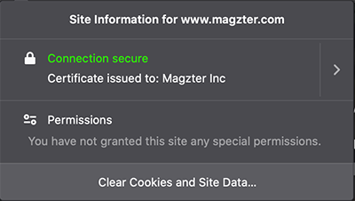
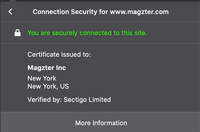
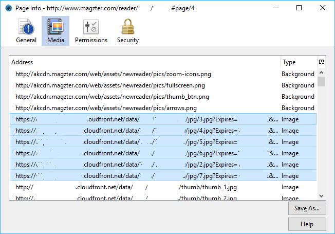

Magzter is a cross-platform, self-service, global digital magazine newsstand with over 8,000 magazines from 3,400+ publishers. Girish Ramdas and Vijayakumar Radhakrishnan founded Magzter in 2011.

Magzter provides multiple ways to read magazines, subscribers or magazine buyers can read through the web browser, iOS App, Android App, Windows Store App and many more. Magazines can also be download on different devices such as iPhone, iPad and Android to be read offline and for later use.

While the iOS and Android App support offline reading, the magazines are not kept forever as the download magazines cannot be exported or saved to other folder locations. Offically there is no way that allows magazines on Magzter to be exported or saved in PDF, pictures or ebook format

However, there is a workaround to save the magazines from Magzter, by saving the offline images downloaded by Magzter to display the magazine in the web browser. Follow the guide below to learn how to export and save the content of magazine you read in Magzter.

1. Download and install [Firefox web browser](https://www.mozilla.org/en-US/firefox/new/) if you don’t already have it.
2. Run Firefox.
3. Vist and login to Magzter.
4. Open the magazine that you want to save a copy.
5. Browse to the page that you want to save a copy.
6. Click or tap on the padlock icon to the left of a web page's address and the image below will appear beneath.

   

7. Then click the right arrow in the Site Information drop-down panel that specifies “www.magzter.com”.

   

8. Click on the More Information button.
9. In the “Page Info” dialog, go to Media tab.
10. In the list of addresses, look for Image type of files that have ?Expires parameter appended to it. These are the caches of the 6 pages of the magazine that are downloaded and presented by Magzter. The 6 images represent previous, next and current magazine spread that you’re opening now.

    

11. Select the pages that you want to save, and hit Save As button to select the folder where you want to store the magazine offline.

12. Repeat the steps by browsing to other pages, and save the new images loaded in the Firefox cache.
13. If you want to save the magazine as Acrobat PDF format, you can paste the JPG images into Microsoft Word and then save the document as PDF, or use any other utilities such as PDF merge applications to perform the conversion.
